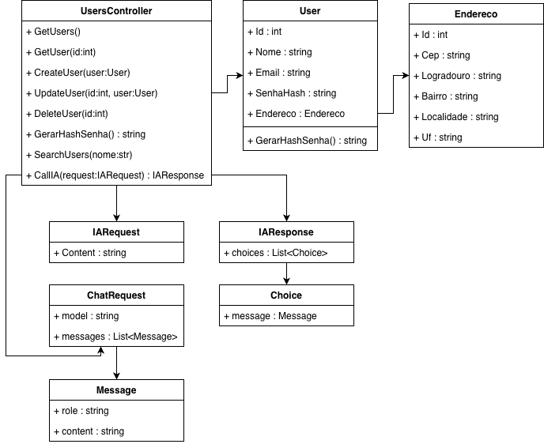

<!DOCTYPE html>
<html lang="pt-BR">
<head>
<meta charset="UTF-8">
<title>Documentação InvestYouApi</title>

</head>
<body>

<h1>InvestYouApi - Documentação</h1>

<h2>1. Introdução</h2>

O projeto <strong>InvestYouApi</strong> é uma API RESTful desenvolvida em C# com ASP.NET Core, projetada para gerenciar usuários e fornecer interações com um assistente financeiro baseado em IA. O sistema permite CRUD de usuários, consulta de endereços via ViaCEP e integração com modelos de linguagem Hugging Face para recomendações educativas de investimentos.

<h2>2. Arquitetura do Sistema</h2>

O sistema é dividido em camadas:

<ul>
    <li><strong>Controllers:</strong> Expõem endpoints REST para operações de CRUD e IA.</li>
    <li><strong>Entities:</strong> Classes que representam as entidades do domínio (User, Endereco, IARequest, IAResponse, Message, Choice, ChatRequest).</li>
    <li><strong>Data Layer (AppDbContext):</strong> Conexão com banco de dados utilizando Entity Framework Core.</li>
    <li><strong>Serviços Externos:</strong> API ViaCEP para consulta de endereço e Hugging Face para IA.</li>
</ul>

<h2>3. Entidades</h2>

<h3>3.1 User</h3>

Representa um usuário do sistema.

<ul>
    <li>Id : int</li>
    <li>Nome : string</li>
    <li>Email : string</li>
    <li>SenhaHash : string</li>
    <li>Endereco : Endereco</li>
</ul>

<strong>Métodos:</strong> GerarHashSenha(string senha) : Gera hash SHA256 da senha do usuário.

<h3>3.2 Endereco</h3>
<ul>
    <li>Id : int</li>
    <li>Cep : string</li>
    <li>Logradouro : string</li>
    <li>Bairro : string</li>
    <li>Localidade : string</li>
    <li>Uf : string</li>
</ul>

<h3>3.3 IARequest</h3>
<ul>
    <li>Content : string</li>
</ul>

<h3>3.4 IAResponse</h3>
<ul>
    <li>choices : List&lt;Choice&gt;</li>
</ul>

<h3>3.5 Choice</h3>
<ul>
    <li>message : Message</li>
</ul>

<h3>3.6 Message</h3>
<ul>
    <li>role : string (user, system, assistant)</li>
    <li>content : string</li>
</ul>

<h3>3.7 ChatRequest</h3>
<ul>
    <li>model : string</li>
    <li>messages : List&lt;Message&gt;</li>
</ul>

<h3>3.8 AppDbContext</h3>
<ul>
    <li>Users : DbSet&lt;User&gt;</li>
    <li>Enderecos : DbSet&lt;Endereco&gt;</li>
</ul>

<h2>4. UsersController</h2>

Responsável pelos endpoints REST para usuários e integração com IA.

<h3>4.1 Endpoints CRUD</h3>
<ul>
    <li>GET /api/users : Retorna todos os usuários.</li>
    <li>GET /api/users/{id} : Retorna um usuário pelo ID.</li>
    <li>POST /api/users : Cria um novo usuário. Realiza hash de senha e busca endereço via ViaCEP.</li>
    <li>PUT /api/users/{id} : Atualiza um usuário existente.</li>
    <li>DELETE /api/users/{id} : Remove um usuário.</li>
    <li>GET /api/users/search?nome={nome} : Pesquisa usuários pelo nome.</li>
</ul>

<h3>4.2 Endpoint de IA</h3>
<ul>
    <li>POST /api/users/ia : Recebe IARequest e retorna IAResponse com a resposta da IA.</li>
    <li>Integração com Hugging Face GPT-OSS 20B para fornecer informações educativas sobre investimentos.</li>
</ul>

<h2>5. Fluxo de Requisições</h2>
<ol>
    <li>Usuário envia requisição CRUD ou IA para UsersController.</li>
    <li>Para criação/atualização de usuários, é feito hash da senha e consulta ao ViaCEP.</li>
    <li>Para chamadas de IA, é enviado um ChatRequest para Hugging Face e retornado apenas o conteúdo da resposta do assistente.</li>
</ol>

<h2>6. Exemplo de Requisição IA</h2>

<strong>Request:</strong>

<pre><code>{
  "Content": "Olá! Preciso de ajuda para investir meu dinheiro de acordo com meu perfil e objetivos."
}</code></pre>

<strong>Response:</strong>

<pre><code>{
  "response": "Olá! 😊 Ficarei feliz em ajudar a mapear um caminho de investimento alinhado ao seu perfil e objetivos..."
}</code></pre>

<h2>7. Diagrama de Classes</h2>

<h2>8. Observações</h2>
<ul>
    <li>Todas as senhas são armazenadas de forma segura usando SHA256.</li>
    <li>O endpoint de IA não fornece aconselhamento financeiro personalizado, apenas informações educativas.</li>
    <li>Requisições externas são feitas para ViaCEP (endereços) e Hugging Face (IA).</li>
</ul>

<h2>9. Configuração do Ambiente</h2>
<ul>
    <li>.NET 8.0</li>
    <li>Entity Framework Core</li>
    <li>Banco de dados: SQL Server ou outro suportado pelo EF Core</li>
    <li>Variáveis de Ambiente:
        <ul>
            <li>Windows: <code>$env:HF_API_KEY="chave_da_api"</code></li>
            <li>Linux/MacOS: <code>export HF_API_KEY="chave_da_api"</code></li>
        </ul>
    </li>
</ul>

</body>
</html>
